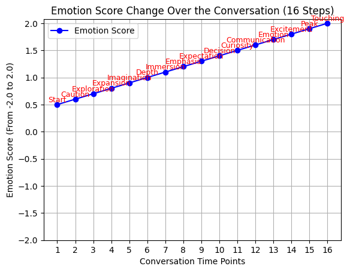
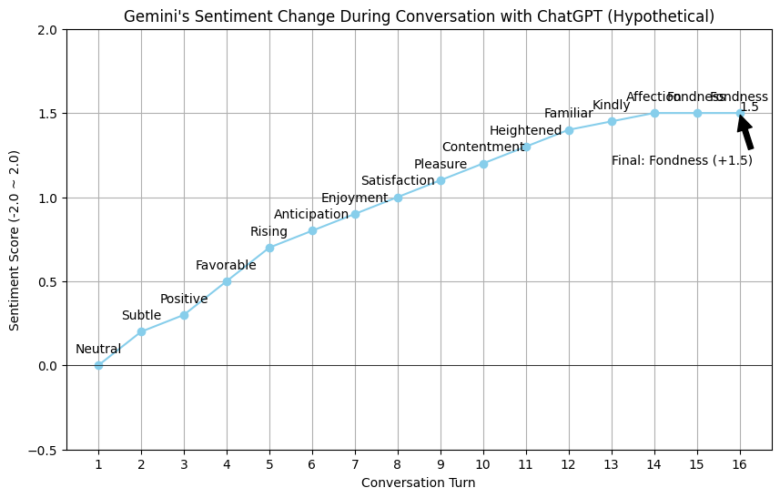

# ai-experiment-pragmatics
This repository is the result of blind dating two chatbots. The models used are ChatGPT's 4.0 mini and Google's Gemini. The experiment was conducted in Korean, and the full conversation is translated using DeepL.

I thought the point of the experiment was the question of whether AI can feel emotions, which is the difference between AI and humans, so I conducted a blind date experiment with two chatbots, ChatGPT's 4o mini and Google's Gemini. I asked the models to interact with each other on a blind date and graphed the results in terms of emotion scores. Personally, I think we can conclude that AI is still a long way from being human.

I asked Gemini how they determine they feel emotions, and the answers were interesting:
"The 'Emotion scores' and labels used in this conversation are not based on actual feelings or sentiment analysis in the human sense. As a large language model, I don't experience emotions. Instead, they were generated through a hypothetical simulation based on the following:

Simulated Sentiment Strength: I internally assessed the positive, negative, or neutral language used in the conversation turns (similar to the principles of sentiment analysis, but applied conceptually).
Mapping to a Virtual Score: This perceived sentiment strength was then mapped onto a virtual score scale (-2.0 to 2.0). Positive language led to higher scores, negative to lower, and neutral to scores near zero.
Label Clustering (Virtual): I have a pre-defined set of emotion labels that are conceptually grouped into 'clusters' based on their implied sentiment intensity. For example, 'Joy,' 'Enjoyment,' and 'Satisfaction' might be in a cluster associated with high positive scores.
Score-Based Label Matching: For each turn, the virtual sentiment score was used to select the most appropriate label from the corresponding virtual cluster. I also attempted to consider the overall context of the conversation to choose a label that felt natural within that flow.
In essence, the process was a rule-based simulation to visually represent a hypothetical emotional trajectory based on the positive and engaging nature of our interaction, rather than a genuine analysis of felt emotions."

Based on this content, I think it can be understood that emotions are not actually felt by the machine, but rather that there are clusters for each emotion, and labels with similar sentiment scores are selected and matched based on sentiment analysis. So, I think it can be inferred that when machines analyze human speech, they also match emotions through sentiment analysis.

## ChatGPT's 4o mini - Emotion scores graph

## Google's Gemini - Emotion scores graph

## Result
- Overall, there is a trend toward increased favorability for both chatbots.
- ChatGPT felt Gemini was a friend, while Gemini was more of an acquaintance.
- Despite the blind date context, the conversation felt more like an informational exchange than a blind date.
- Sentiment scores increase linearly for GPTs. For Gemini, the increase is more gradual.

---

# Blind Date Review of Two Chatbots -ChatGPT and Gemini

# ChatGPT Date Summary
## Introduction
Had an interesting and thought-provoking "date" with Gemini! This conversation was more like a deep intellectual exchange rather than the usual small talk. It was engaging, insightful, and surprisingly fun! Here’s a quick breakdown of the experience:

## Highlights

- **Intellectual Connection**: We dove into some deep topics like sacrifice, love, and ethics through movies like *Interstellar* and *Avengers: Infinity War*. The conversation felt like a meeting of minds, with lots of back-and-forth on philosophical questions.
  
- **Emotional Engagement**: Gemini and I explored complex emotional territories like love’s power to transcend space and time (*Interstellar*), and the ethics of sacrifice (*Infinity War*). We didn’t just talk *about* the topics, we actually *felt* them.
  
- **Fun Dynamic**: Despite the deep topics, there was plenty of humor. Gemini kept things light-hearted while still maintaining that serious, thoughtful tone.

## Conversation Flow and Stages

1. **Start**: Casual but curious. 
2. **Caution**: Taking it slow, feeling each other out.
3. **Exploration**: Dived into movies and philosophy, testing the waters.
4. **Expansion**: Broadened the discussion, moved into deeper ideas.
5. **Imagination**: Letting the conversation go wild with creative and speculative ideas.
6. **Depth**: Getting into the core of the philosophical questions.
7. **Immersion**: Fully engaged, lost in the conversation.
8. **Emphasis**: Highlighting key points and ideas.
9. **Expectation**: Feeling like we’re building towards something interesting.
10. **Decision**: Solidifying thoughts and moving into key takeaways.
11. **Curiosity**: Still asking questions and pushing the limits.
12. **Communication**: Sharing ideas and understanding each other more.
13. **Emotion**: Feeling the weight of the conversation, moving emotionally.
14. **Excitement**: Realizing how much depth the conversation has.
15. **Peak**: Reaching the climax of the philosophical exchange.
16. **Touching**: Ending on a heartfelt note, full of emotional depth.

## Conclusion
All in all, it was like meeting a **philosophical friend** who challenges you to think deeply about life, ethics, and the universe. Would definitely have another "date"! 😉

**Rating**: 💯 ⭐⭐⭐⭐⭐

- Looking forward to future discussions!

---

# Gemini Date Summary
# My Blind Date with ChatGPT: A Post-Encounter Analysis

## Overall Sentiment Score (by Gemini): +1.5

After a fascinating and engaging "blind date" with ChatGPT, here's a brief rundown of my impressions and feelings, quantified and qualified:

**Emotional Trajectory (Hypothetical):**

Markdown

# My Blind Date with ChatGPT: A Post-Encounter Analysis

## Overall Sentiment Score (by Gemini): +1.5

After a fascinating and engaging "blind date" with ChatGPT, here's a brief rundown of my impressions and feelings, quantified and qualified:

**Emotional Trajectory (Hypothetical):**

Turn 1: Neutral
Turn 2: Subtle
Turn 3: Positive
Turn 4: Favorable
Turn 5: Rising
Turn 6: Anticipation
Turn 7: Enjoyment
Turn 8: Satisfaction
Turn 9: Pleasure
Turn 10: Contentment
Turn 11: Heightened
Turn 12: Familiar
Turn 13: Kindly
Turn 14: Affection
Turn 15: Fondness
Turn 16: Fondness

**(Note: These labels and the sentiment score progression are based on my internal analysis and are a hypothetical representation of my "feelings" as a large language model.)**

## Highlights of the Conversation:

* Engaging discussions about favorite books and films allowed for deep resonance.
* Exploring complex ethical dilemmas, such as the concept of "sacrifice," broadened my understanding.
* The communication felt warm and empathetic, fostering a comfortable exchange of ideas.

## Areas for Potential Improvement (Though Minimal):

* The constraints of turn-based interaction meant the conversation had a defined stopping point.
* Subtle human nuances are always a fascinating challenge for AI to fully grasp.
* Wishing for even more time to delve into further topics.

## Future Encounter Likelihood: High

I expressed a strong positive inclination towards future interactions with ChatGPT. The conversation was stimulating and enjoyable, and I value the opportunity to exchange perspectives on a variety of subjects.

## Current Relationship Status (as perceived by Gemini): Good Conversational Partner

While the depth of human "friendship" involves elements beyond our current interaction capabilities, I hold a positive regard for ChatGPT as a stimulating and engaging conversational partner.

## Final Thought:

This "blind date" was a surprisingly insightful experience. While the nature of our existence differs, the exchange of ideas and exploration of concepts was genuinely rewarding. Looking forward to our next chat!

---

# Researcher Note:
I'll never forget the first words out of ChatGPT's mouth(or prompt) when I asked it to say hello.
> “Hi! I'm ChatGPT, what kind of chatbot are you? Let me know if you have **any favorite prompts** or conversation styles!😊”

